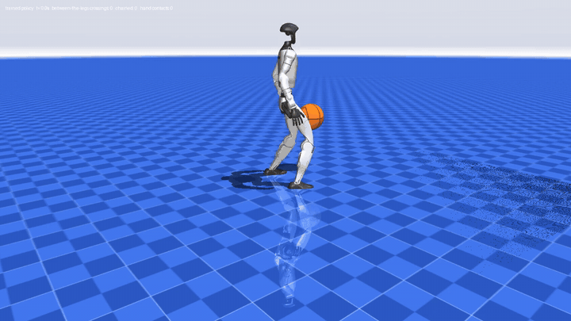

<div align="center">

# G1 Brunson

**A Unitree G1 humanoid that dribbles a basketball between its legs.**

Trained with reinforcement learning in MuJoCo MJX. Sees the ball with its own head camera. No hardware on the ball.



[Full demo video (MP4)](docs/g1_brunson_demo.mp4) · [Results](#results) · [Reproduce](#reproduce-the-results) · [Deploy](#deploy-on-a-real-g1)

</div>

---

## What it does

G1 Brunson is a whole-body controller for the standard Unitree G1 (29 joints, rubber hands). The robot stands in a staggered athletic stance with a regulation size-7 basketball and dribbles it back and forth **between its legs**, left hand to right hand and back, with one bounce through the gap between the feet on every crossover. The ball is pushed with the palm, the way a player dribbles.

| Over a 20-second test (average of 12 episodes) | |
|---|---|
| Between-the-legs crossovers | **44.3** |
| Chained crossovers (caught and immediately crossed again) | **37.6** |
| Dribble rhythm | one bounce every 0.31 s |
| Ball height at the top of each dribble | 0.39 m, about mid-thigh |
| Falls | **0 of 12** |

With the **head camera as the only source of ball information**, the same controller performs 41.8 crossovers per 20 s with no falls.

## Results

Every test is 12 episodes of 20 s with fixed seeds, so the numbers are repeatable. A do-nothing controller runs on the identical episodes as a control.

| 12 episodes × 20 s | G1 Brunson | do-nothing control |
|---|---|---|
| crossover dribbles | 44.3 | 0.0 |
| chained crossovers | 37.6 | 0.0 |
| catches by the receiving hand | 40.8 | 0.0 |
| hand–ball contacts | 49.5 | 0.2 |
| ball replaced (rolled away or came to rest) | 5.3 | 2.3 |
| fell during the episode | 0 / 12 | 12 / 12 |
| episodes with ≥ 6 crossovers and no fall | 12 / 12 | 0 / 12 |

**Camera-in-the-loop** (6 episodes × 20 s, controller receives only the head-camera tracker's output): 41.8 crossovers, 35.5 chained, 0 falls, ball detected on 95 % of frames, ball position error 3 mm at detection.

Raw data: [`evaluation/results.json`](evaluation/results.json), [`evaluation/episodes.csv`](evaluation/episodes.csv), [`evaluation_vision/results.json`](evaluation_vision/results.json). Videos: [`evaluation/trained.mp4`](evaluation/trained.mp4), [`evaluation/neutral.mp4`](evaluation/neutral.mp4).

## How it works

**Simulation.** Unitree's official G1 description (`g1_29dof_rev_1_0`) with Unitree's collision model, deployed PD gains, torque limits and rotor inertias. The rubber hand is a palm-sized box fitted to the hand mesh. Control at 50 Hz over 2 ms physics steps, in Unitree's joint order, exactly like a hardware deployment. The ball is a size-7 game ball (radius 0.11926 m, 0.6237 kg, thin-shell inertia) whose bounce is calibrated to the official inflation test (1.8 m drop, 1.30 m rebound). Every number is traceable to a source in `assets/`.

**Controller.** A 512-256-128 MLP reads 115 numbers (IMU, joint positions and velocities, previous action, three frames of tracked ball position and velocity, four task cues) and outputs 29 joint targets. Trained with PPO (Brax) on MuJoCo MJX, 4,096 robots in parallel on one GPU, asymmetric actor-critic (the critic sees the true ball state, the actor never does).

**Reward.** The crossover is scored as a sequence of events, not a distance: +3 for a bounce that lands between the feet, travels toward the receiving hand, follows a hand contact and rose to at least 0.30 m; +2 when the receiving hand catches it; +2 for chaining into the next crossover; +1 per dribble contact. Penalties for a bounce that is not a crossover, the wrong hand, a lost ball, a low dribble and a fall, plus the usual posture, foot-planting and smoothness terms. All terms are in `dribble_env.py`.

**Perception.** The G1's head camera (Intel RealSense D435i) is used depth-first: the depth image is compared with a render of the robot's own body from its joint sensors, anything closer than the robot's body is the ball, and a sphere of known radius is fitted to it. Colour is the fallback. A Kalman tracker with a ballistic bounce model carries the ball through the moments it is hidden under the body. The **same tracker is replicated inside the training environment**, so the controller was trained on exactly the kind of estimate the real camera produces.

**Robustness.** Training randomised link masses, motor gains, friction, ball mass and bounce, sensor offsets and noise, tracker delay up to 40 ms, and applied random pushes to the hips.

## Repository layout

```
policy.py              controller: MLPPolicy (numpy, no JAX needed) + DribbleTracker (task cues)
policy_weights.npz     trained weights of G1 Brunson
vision.py              head-camera ball perception (depth-first, colour backup, Kalman tracker)
dribble_env.py         MJX training environment, reward, domain randomisation, perception emulation
train.py               PPO training (Brax)
evaluate_mjx.py        standard 12-episode test + causality control + videos
evaluate_vision.py     the same test with the head camera in the loop
export_policy.py       Brax params -> policy_weights.npz (verified numerically)
build_model.py         builds assets/ from Unitree's robot description
calibrate_ball.py      fits the ball's bounce to the official inflation test
replay_viewer.py       interactive 3-D replay of a recorded test
render_traj.py         recorded test -> MP4
assets/                robot, ball, court, calibration reports, Unitree source files
checkpoints/           g1_brunson_params.pkl (Brax checkpoint, for fine-tuning)
evaluation/            results, per-episode CSV, videos, recorded trajectories
evaluation_vision/     camera-in-the-loop results
logs/                  training logs of the three stages
```

## Quick start (CPU, 5 minutes)

```bash
git clone https://github.com/AmoghShrivastava/g1-brunson.git
cd g1-brunson
python -m venv .venv && source .venv/bin/activate      # Windows: .venv\Scripts\activate
pip install -r requirements-train.txt                 # JAX CPU is fine for evaluation

python evaluate_mjx.py --episodes 12 --video_episodes 2    # -> evaluation/results.json + trained.mp4
python replay_viewer.py evaluation/traj_trained_ep0.npz    # interactive 3-D viewer
```

The same files are mirrored on Hugging Face: `hf download AmoghShrivastava1/g1-brunson --local-dir g1-brunson` (weights, checkpoint, code and results). Interactive 3-D replay and head-camera frames: [dribble.tenacelabs.com](https://dribble.tenacelabs.com).

Camera-in-the-loop test (renders the head camera every step, slower):

```bash
python evaluate_vision.py --episodes 6 --env_contact
```

## Reproduce the results

Training was done on a single NVIDIA L4 (24 GB). One stage of 100 M steps takes about 3.5 hours at 4,096 environments. Budget about 24 GPU-hours end to end.

### 0. Environment

```bash
pip install -r requirements-train.txt      # jax[cuda12] 0.10.2, mujoco 3.12, mujoco-mjx 3.12, brax 0.14, playground 0.2
export MUJOCO_GL=egl
```

`setup_vm.sh` does this on a fresh Ubuntu GPU box, including fetching Unitree's robot description.

### 1. Build the scene (optional, `assets/` is already built)

```bash
git clone --depth 1 https://github.com/unitreerobotics/unitree_ros.git   # robots/g1_description
python build_model.py --unitree_ros unitree_ros/robots/g1_description --mjlab_xml mjlab_g1.xml
python calibrate_ball.py --timeconst 0.03 --mjx                        # writes assets/ball_calibration.json
python build_model.py --unitree_ros unitree_ros/robots/g1_description --mjlab_xml mjlab_g1.xml \
       --ball_solref "0.03 <dampratio from assets/ball_calibration.json>"
```

`build_model.py` also writes `assets/urdf_verification.json` (mass of every link checked against the URDF).

### 2. Stage 1: learn the crossover (from scratch, ~230 M steps)

```bash
python train.py --out runs/stage1 --num_envs 4096 --num_timesteps 230000000 --num_evals 23
```

Training-time eval reaches about 18 crossovers per episode. Log of the run that became the base: `logs/train_C_apex2.log`.

### 3. Stage 2: refine (~210 M steps, same config)

```bash
python train.py --out runs/stage2 --restore runs/stage1/params.pkl \
       --num_envs 4096 --num_timesteps 210000000 --num_evals 21
```

Reaches about 25 crossovers per episode in training eval, and 44 in the clean 12-episode test. Log: `logs/train_F_state.log`.

### 4. Stage 3: fine-tune with the head-camera tracker emulated (100 M steps) → G1 Brunson

```bash
python train.py --out runs/stage3 --restore runs/stage2/params.pkl \
       --num_envs 4096 --num_timesteps 100000000 --num_evals 10 --lr 1e-4 --entropy 0.002 \
       --override vision_config.enable=true --override vision_config.kalman=true \
       --override vision_config.dropout=0.12 --override vision_config.pos_noise=0.02 \
       --override vision_config.vel_noise=0.5 \
       --override vision_config.tan_half_h=0.949 --override vision_config.tan_half_v=0.554
```

Use the lower learning rate: 3e-4 destroys a warm start. Log: `logs/train_G_brunson.log`. The shipped checkpoint is `checkpoints/g1_brunson_params.pkl`; start from it directly to skip stages 1–3.

### 5. Export and test

```bash
python export_policy.py runs/stage3/params.pkl --out policy_weights.npz   # asserts numpy == JAX forward pass
python evaluate_mjx.py --episodes 12 --video_episodes 2                    # clean test
python evaluate_vision.py --episodes 6 --env_contact                       # camera in the loop
```

Expected: about 44 crossovers, 0 falls, do-nothing control 0 crossovers. Seeds are fixed (`--seed 1000`), so the numbers should match `evaluation/` to within GPU nondeterminism.

## Deploy on a real G1

The controller has no JAX dependency at run time. `policy.py` is plain numpy, and the loop is the standard Unitree low-level position-control loop.

**Loop (50 Hz):**

1. Read the IMU (gyro, gravity direction) and the 29 joint positions and velocities from the low-level state, in Unitree's joint order.
2. Read the head camera. `vision.BallPerception` takes the depth frame plus a depth render of the robot's own body from the joint state, detects the ball (colour as fallback) and tracks it with `vision.BallKalman`. Output: ball position and velocity in the world frame.
3. `policy.DribbleTracker.update(ball_pos, ball_vel, feet, hand_contact, body_left)` turns that into the four task cues (which hand plays next, ball released, time since bounce, stance). Foot positions come from forward kinematics of the joint state.
4. Build the observation dict (`gyro`, `gravity`, `joint_pos_rel`, `joint_vel`, `ball_rel` in the pelvis frame, `cue`, `stance_targets`) and call `policy.Policy.act(obs)`. It keeps the action and ball history itself; call `reset()` once at start.
5. Send the returned 29 joint targets to the motors with Unitree's deployment gains (kp legs 40.2 / 99.1 / 40.2 / 99.1 / 28.5 / 28.5, waist 40.2 / 28.5 / 28.5, arms 14.3 × 5, 16.8, 16.8; matching kd), the same values as in `assets/g1_robot.xml`.

`evaluate_vision.py` is a complete reference implementation of this loop against the simulator; port it line for line.

**Hardware notes:**

- **Hand contact signal.** The tracker needs to know when a palm touches the ball with under 20 ms latency. The G1's rubber hands have no tactile sensor; use the wrist joint torque/current transient or the velocity discontinuity of the tracked ball at the palm. `evaluate_vision.py --env_contact` shows how the flag is consumed.
- **Camera mount.** The perception assumes Unitree's stock D435i mount (looking 47.6° down, 87° × 58° depth field of view). If the mount differs, update the camera pose in `assets/g1_dribble_scene.xml` and re-run stage 3.
- **Ball.** Regulation size-7 ball inflated to spec (1.8 m drop rebounds to 1.2–1.4 m). Training covered that whole band.
- **Start.** Place the robot in the staggered stance from `assets/stance.json` and hand it the ball at hip height on the left side; the controller begins dribbling from the first bounce.
- **Safety.** Run with a gantry or harness first. Results in this repository were measured in simulation only.

## License

MIT (this repository). Unitree G1 description: BSD-3-Clause, Unitree Robotics. See `NOTICES.md`.
